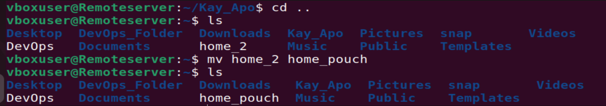

# LinuxPracticeProject
## A repo that documents my learning path in Linux
### PART 1: File Manipulation
1. sudo command: performing tasks that require administrative or root permissions. e.g;
  - sudo apt upgrade, 
  
  - sudo -h, 
  

2. pwd command: returns full current path in the working directory
  

3. cd command: switches to a completely new directory
  

4. ls command: lists files and directories within a system
  

5. cat command: lists, combines and writes file content. e.g;
  - cat filename.txt - lists or writes contents in a file from the top
  
  - tac filename.txt - lists or writes contents in a file from the bottom
  

6. cp command: copy files or directories and their content
  

7. mv command: move and rename files and directories
  - moving a file
  
  - renaming a file
  

8. mkdir command: creates one or multiple directories and sets permissions for them
  - creating a new directory
  
  - creating a new directory inside an existing directory
  
  - creating a directory between two existing folders 
  
  - creating a directory with full read, write and execute permissions for all users
  

9. rmdir command: permanently deletes an empty directory (must have sudo privileges in the parent directory)
   

10. rm command: delete files within a directory (if there are 'write permissions')
    
    NB: -i prompts system confirmation before deleting a file; -f removes without confirmation, -r deletes files and directories recursively
    

11. touch command: creates an empty file
    

12. locate command: finds a file in the database system.
    NB: 1. adding -i turns off the case sensitivity; 2. add an * if looking for 2 or more words
    

13. find command: search for files within a specific directory and performs subsequent operations. 
    
  or
    

14. grep command: allows search for a word through all the texts in a specific file
    

15. df command: reports the system's disk space usage displayed in % and kb
    - df -h
    
    - df -m
    
    - df -k
    
    - df -T
    

16. du command: checks how much space a directory or file takes
    
    1. -s gives the total size of a folder; 
    
    2. -m gives folder and file information in MB;
    
    3. -k gives folder and file information in KB;
    

17. head command: views the first 5 lines of a text
    

18. tail command: views the last 5 lines of a text
    

19. diff command: compares two contents of a file line by line and displays the unmatched part
    
    1. -c displays the difference between two files contextually 
    
    2. -u displays the output without redundant information
    
    3. -i makes the diff command case insensitive
    

20. tar command: archives multiple files into a TAR file 
    

------------------------------------------------------------------------------------------------------------------------

### PART 2: File Permissions and Ownership

21. chmod command: modifies a file or directory's read, write and execute permissions
    

22. chown command: changes the ownership of a file, directory or symbolic link to a specified username
    

23. jobs command: This is a process started by the shell. It displays all running processes along with their statuses
  NB: available only in csh, bash, tcsh, and ksh shells
    - -i list process IDs and their info;
    - -n lists jobs whose status have changed since last time;
    - -p list process IDs only

24. kill command: terminates an unresponsive program manually. To do this, one must know the PID - process identification number. ie. ps ux
    
after getting the signal and PID, enter 'kill [signal_option] pid'
e.g. of signals = SIGTERM, SIGKILL

25. ping command: checks whether a network or a server is reachable. used for troubleshooting connectivity issues
    

26. wget command: lets you download files from the internet. It works in the background without hindering other running processes
    

27. uname command: prints detailed info about your Linux system and hardware
    
  Other options include:
  - -a which prints the system info; -s prints the kernel name; and -n prints the system's node hostname
    

28. top command: displays all the running processes and real-time view of the current system. Also helps to identify and terminate a process that may use too many resources
    

29. history command: lists up to 500 previously executed commands, and allows you to reuse them without re-entering. Only user with sudo privileges can perform it
    

30. man command: provides manual of any commands or utilities run in the terminal
    man ls = 

31. echo command: displays a line of text or string using the standard output
    OPTIONS: -n displays output; -e enables interpretation of backlash escapes; \a plays sound alert; \b removes spaces in between the text; \c produces no further output; -E displays the default option and disables the interpretation of backlash escapes.

32. zip, unzip commands: compresses files into ZIP file
    

33. hostname command: reveals the system's hostname
    - can be executed alone or with other flags like -a, -i, -d
    

34. useradd, userdel commands: 
    - useradd: creates new account
    
    - userdel: deletes account
    

35. apt-get command: retrieves information and bundles from authenticated sources to manage software
    - apt-get update: synchronizes the package file from their sources
      
    - apt-get upgrade: installs the latest version of all installed packages
      
    - apt-get check: updates the package cache and checks broken dependencies 
      

36. nano, vi, jed commands: allows user to edit and manage files via a text editor
    - nano: using command nano DevOps to read the file named DevOps
      
    - vi: saves, opens, copies, and pastes a file
      
    - jed: has modes to load modules or plug-ins to write specific text
      

37. alias, unalias commands: alias allows you to create shortcut with the same functionality as a command, file name or text, while unalias deletes an existing alias
      

38. su command: switch user command allows you to run a program as a different user
    NB: other options include, -p, -s, -l
    

39. htop command: monitors system resources and server processes in real-time
    
    - -C or -no-color: enables the monochrome mode
      
    - -help: displays the help message and exit
      

40. ps command: is called process status command, it produces a snapshot of all the running processes in the system
    
    - -T displays all the processes associated with the current shell session
      
    - -u list processes associated with a specific user
      
    - -A or -e shows all the running processes
      

