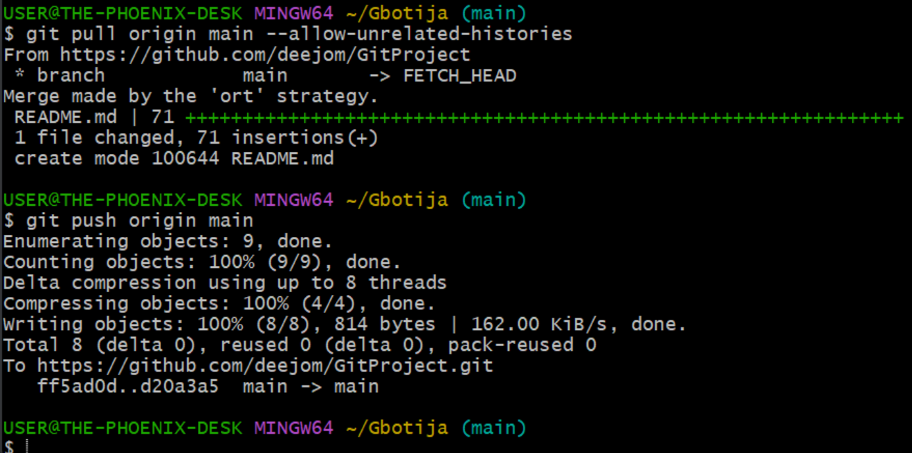

# GitProject
## Tracking my Git Learnings 

### PART 1: Initializing a Repository and Making Commits
A. INITIALIZING A REPOSITORY 

STEPS: Open 'Git Bash' >> mkdir Gbotija >> cd Gbotija >> run 'git init'

B. MAKING COMMITS

STEPS: Create a file while still in the working directory DevOps - 'touch index.txt' >> write any sentence in the file >> add your changes to git - 'add git .' >> to commit run 'git commit -m "initial commit"

NB: -m flag is used to provide a commit message. A commit message should be as descriptive as possible. Let it explain why the commit was made. 

C. MAKING A GIT BRANCH

STEP: Run "git checkout -b master" 

NB: -b flag helps create and change into the new branch

D. LISTING YOUR GIT BRANCHES

STEP: Just run "git branch"

E. CHANGING INTO AN OLD BRANCH

STEP: Run "git checkout main"

F. MERGING A BRANCH INTO ANOTHER BRANCH

To merge the content of branches master into main, we first change into main and run "git merge master"

G. DELETING A GIT BRANCH

Usually, after adding the required features to an application or dev environment, the temporal branch is deleted

To do that run "git branch -d master"

H. LEARNING MORE

### PART 2: COLLABORATION AND REMOTE REPOSITORIES

A. CREATING A GITHUB ACCOUNT 
- Already done here

B. PUSHING LOCAL GIT REPOSITORY TO REMOTE GITHUB REPOSITORY
- To do this, copy the remote link and run "git remote add origin <link to your github repo> 

- After committing the change in the local repo, push to the remote repo using: git push origin <branch name>

C: CLONING REMOTE GIT REPOSITORY
- Git Clone helps to make a copy of the remote repo in the local machine
 

### PART 3: BRANCH MANAGEMENT AND TAGGING

A. INTRODUCTION TO MARKDOWN SYNTAX

1. HEADING: To create heading, use the hash symbol at the beginning of the line. The number of hash symbol used determine the level of the heading.
   # Heading
   ## Heading
   ### Heading
   ##### Heading

2. EMPHASIS: Asterisks or underscore is used to emphasize text.

   *italic* or _italic_
   **bold** or __bold__

3. LISTS: Markdown has support for both ordered and unordered lists.

   a. Ordered list 
  - Item 1
  - Item 2
  - Item 3
    
    b. Unordered list
    1. First item
2. Second item
  3. Third item

4. LINKS: To create a hyperlink, use square brackets for the link text followed by parenthesis containing the url. 

   [visit darey.io] (https://www.darey.io)

5. IMAGES: To display an image, use exclamation mark followed by square brackets for the alt text and parenthesis containing the image url. 
   
   ![Alt Text] (https://example.com/image.jpg)

6. CODE: To display code or code snippets, use backticks (``) to enclose the code. 

   `console.log('Welcome to darey.io')`

7.  [Learn more...](https://learn.microsoft.com/en-us/contribute/content/markdown-reference) 

[... and more.](https://www.markdownguide.org/cheat-sheet/)
   
