# Shell_Scripting
### Practical Demonstrations and Interactive Exercises 

## SHELL SCRIPTING SYNTAX ELEMENTS

#### 1. VARIABLES: Stores data of various types like numbers, strings, arrays, etc
E.g.
* Assigning value to a variable - ```name="John"```

* Retrieving value from variable - ```echo $name```

#### 2. CONTROL FLOW: Controls flow of statements like if-else, for loops and case statements, making it possible to make decisions, iterate based over lists and execute different commands based on conditions.
E.g.
* Used if-else to execute script based on conditions:
```ruby
#!/bin/bash

# Example script to check if a number is positive, negative, or zero

read -p "Enter a number: " num

if [ $num -gt 0 ]; then
    echo "The number is positive."
elif [ $num -lt 0 ]; then
    echo "The number is negative."
else
    echo "The number is zero."
fi
```
The result was:
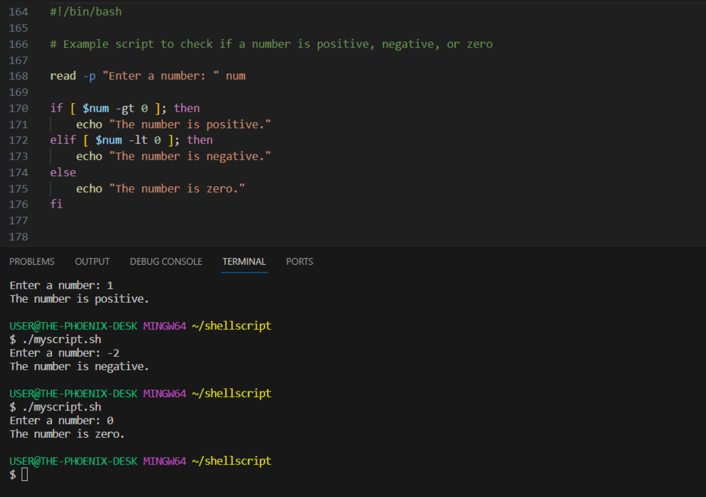

* Iterated through a list using a *for loop*
```ruby
#!/bin/bash

# Example script to print numbers from 1 to 5 using a for loop

for (( i=1; i<=5; i++ ))
do
    echo $i
done
```
The result was: 
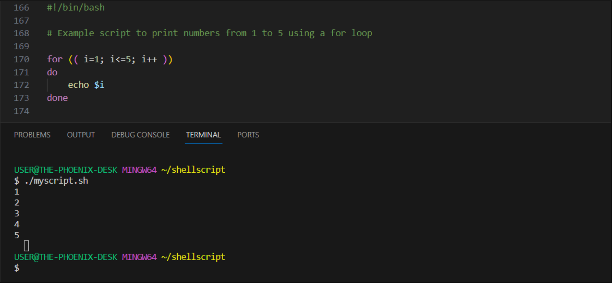

#### 3. COMMAND SUBSTITUTION: Allows capturing output of a command and use as a value within the script.

E.g.
* Used backtick for command substitution - ```current_date=`date +%Y-%m-%d` ```

* Used ```$()``` syntax for command substitution - ```current_date=$(date +%Y-%m-%d)```

#### 4. INPUT AND OUTPUT: Used to read command to accept user input and output text to the console using the echo command.
E.g.
* Accepted user input -
```
  echo "Enter your name:"
read name
```
* Output text to the terminal - ```echo "Hello World"```

* Output the result of a command into a file - ```echo "hello world" > index.txt```

* Passed the content of a file as input to a command - ```grep "pattern" < input.txt```

* Passed the result of a command as input to another command - ```echo "hello world" | grep "pattern"```

#### 5. FUNCTIONS: Bash allows definition and use of functions to group related commands together, making it more reusable.
```ruby
#!/bin/bash

# Define a function to greet the user
greet() {
    echo "Hello, $1! Nice to meet you."
}

# Call the greet function and pass the name as an argument
greet "John"
```
The result was: 
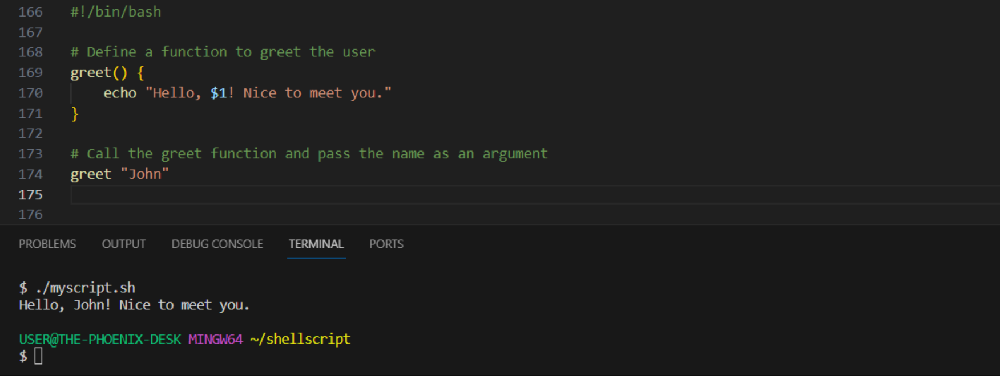

## SHELL SCRIPTING PRACTICE 

STEP 1: I opened a folder using the command - ```mkdir shell-scripting```
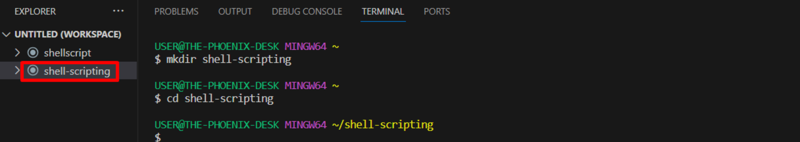

STEP 2: Created a file called *user-input.sh* using the command - ```touch user-input.sh``` 
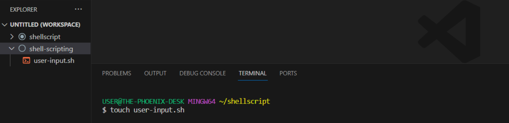


STEP 3: Inside the file, I copied and pasted the code below: 
```ruby
#!/bin/bash

# Prompt the user for their name
echo "Enter your name:"
read name

# Display a greeting with the entered name
echo "Hello, $name! Nice to meet you."
```

STEP 4: Saved the file 

STEP 5: To make the file executable, I ran the command - ```sudo chmod +x user-input.sh```

STEP 6: Ran the script using the command - ```./user-input.sh```
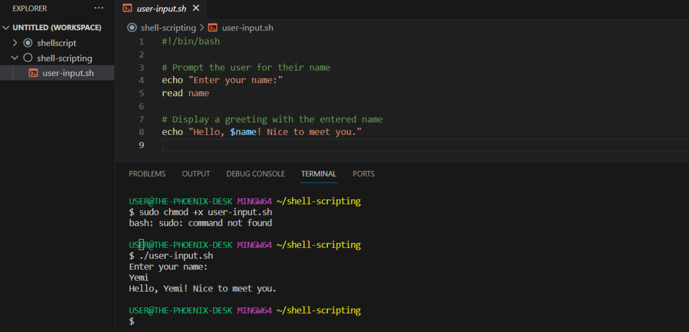


## DIRECTORY MANIPULATION AND NAVIGATION 
The script below: 
1. Displayed the current directory
2. Created a new directory called "my_directory"
3. Changed to that directory
4. Created two files inside it
5. Listed the files
6. Moved back one level up
7. Removed the "my_directory" and its contents, and finally 
8. Listed the files in the current directory again

To achieve this, I followed the steps below: 

STEP 1: Opened a file called *navigating-linux-filesystem.sh*

STEP 2: Pasted the code block below into the file:
```ruby
#!/bin/bash

# Display current directory
echo "Current directory: $PWD"

# Create a new directory
echo "Creating a new directory..."
mkdir my_directory
echo "New directory created."

# Change to the new directory
echo "Changing to the new directory..."
cd my_directory
echo "Current directory: $PWD"

# Create some files
echo "Creating files..."
touch file1.txt
touch file2.txt
echo "Files created."

# List the files in the current directory
echo "Files in the current directory:"
ls

# Move one level up
echo "Moving one level up..."
cd ..
echo "Current directory: $PWD"

# Remove the new directory and its contents
echo "Removing the new directory..."
rm -rf my_directory
echo "Directory removed."

# List the files in the current directory again
echo "Files in the current directory:"
ls
```

STEP 3: To execute permission on the file, ran the command ```sudo chmod +x navigating-linux-filesystem.sh```

STEP 4: Ran the script using the command - ```./navigating-linux-filesystem.sh```

The result was: 
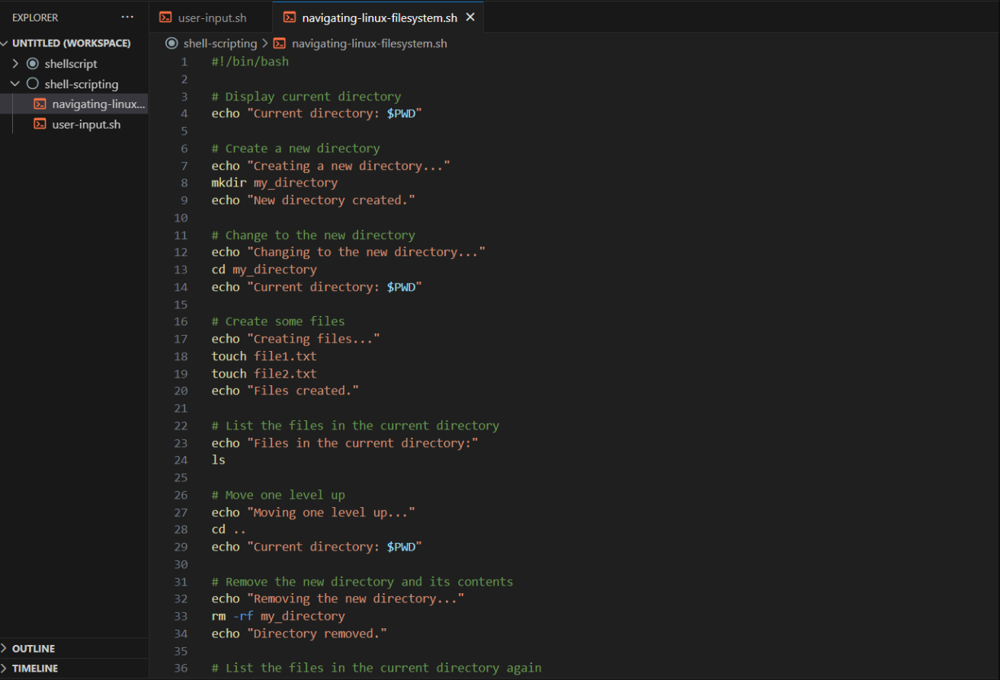
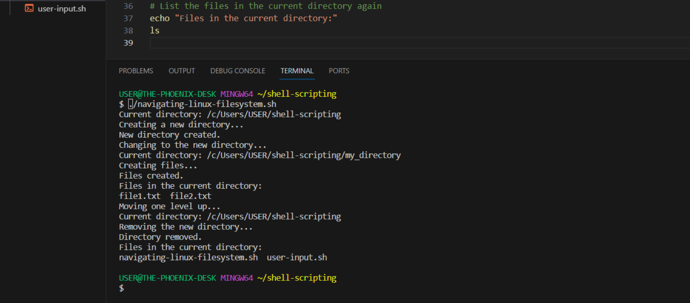


## FILE OPERATIONS AND SORTING
The script below:
1. Created three files
2. Displayed the files in their current order
3. Sorted them alphabetically
4. Saved the sorted files in sorted_files.txt
5. Displayed the sorted files
6. Removed the original files
7. Renamed the sorted file to sorted_files_sorted_alphabetically.txt, and finally
8. Displayed the content of the final sorted file

To achieve this, I followed the steps below: 

STEP 1: Opened the terminal and created a file called *sorting.sh* using the command - ```touch sorting.sh```

STEP 2: Copied and pasted the code block into the file:
```ruby
#!/bin/bash

# Create three files
echo "Creating files..."
echo "This is file3." > file3.txt
echo "This is file1." > file1.txt
echo "This is file2." > file2.txt
echo "Files created."

# Display the files in their current order
echo "Files in their current order:"
ls

# Sort the files alphabetically
echo "Sorting files alphabetically..."
ls | sort > sorted_files.txt
echo "Files sorted."

# Display the sorted files
echo "Sorted files:"
cat sorted_files.txt

# Remove the original files
echo "Removing original files..."
rm file1.txt file2.txt file3.txt
echo "Original files removed."

# Rename the sorted file to a more descriptive name
echo "Renaming sorted file..."
mv sorted_files.txt sorted_files_sorted_alphabetically.txt
echo "File renamed."

# Display the final sorted file
echo "Final sorted file:"
cat sorted_files_sorted_alphabetically.txt
```

STEP 3: To execute permission on the file, I ran the command ```sudo chmod +x sorting.sh```

STEP 4: Ran the script using the command - ```./sorting.sh```

The result was: 
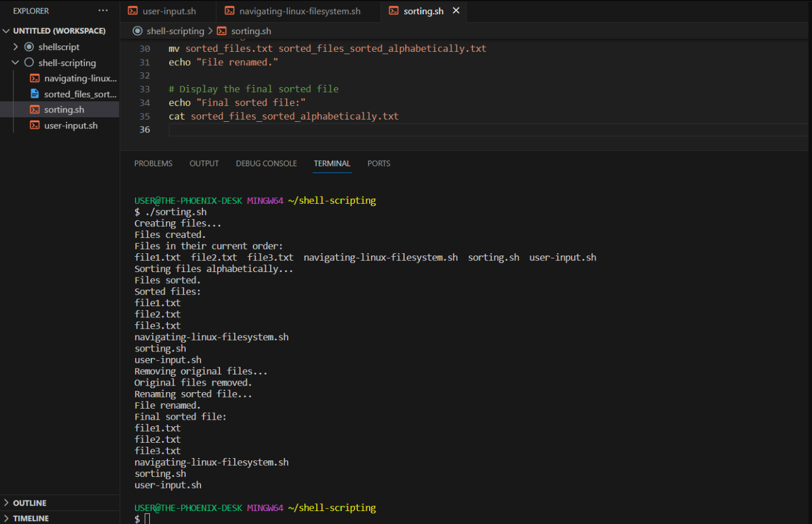


## WORKING WITH NUMBERS AND CALCULATIONS
The script below:
1. Performed basic arithmetic operations (addition, subtraction, multiplication, division and modulus), and displayed the result
2. Performed more complex calculations, like raising the power of 2 and also displayed it.

To achieve this, I follow the steps below: 

STEP 1: Opened the terminal and created a file called *calculation.sh* using the command - ```calculation.sh```

STEP 2: Copied and pasted the code block into the file:
```ruby
#!/bin/bash

# Define two variables with numeric values
num1=10
num2=5

# Perform basic arithmetic operations
sum=$((num1 + num2))
difference=$((num1 - num2))
product=$((num1 * num2))
quotient=$((num1 / num2))
remainder=$((num1 % num2))

# Display the results
echo "Number 1: $num1"
echo "Number 2: $num2"
echo "Sum: $sum"
echo "Difference: $difference"
echo "Product: $product"
echo "Quotient: $quotient"
echo "Remainder: $remainder"

# Perform some more complex calculations
power_of_2=$((num1 ** 2))
square_root=$(awk "BEGIN{ sqrt=$num2; print sqrt }")

# Display the results
echo "Number 1 raised to the power of 2: $power_of_2"
echo "Square root of number 2: $square_root"
```

STEP 3: To execute permission on the file, I ran the command ```sudo chmod +x calculation.sh```

STEP 4: Ran the script using the command - ```./calculation.sh```

The result was:
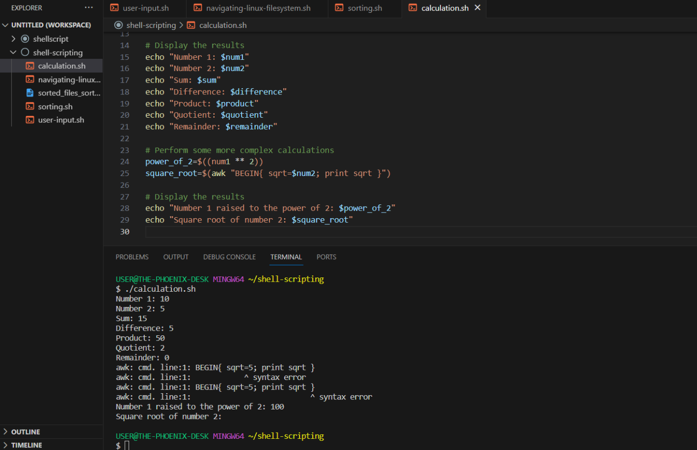


## FILE BACKUP AND TIMESTAMPING
The script below:
1. Defined the source directory and backup directory paths
2. Created a timestamp using the current date and time
3. Created a backup directory with the timestamp appended to its name
4. Copied all files from the source directory
5. Displayed a message indication the completion of the backup process
6. Showed the path of the backup directory with timestamp

To achieve this, I followed the steps below: 

STEP 1: Opened the terminal and created a file called *backup.sh* using the command - ```backup.sh```

STEP 2: Copied and pasted the code block into the file:
```ruby
#!/bin/bash

# Define the source directory and backup directory
source_dir="/path/to/source_directory"
backup_dir="/path/to/backup_directory"

# Create a timestamp with the current date and time
timestamp=$(date +"%Y%m%d%H%M%S")

# Create a backup directory with the timestamp
backup_dir_with_timestamp="$backup_dir/backup_$timestamp"

# Create the backup directory
mkdir -p "$backup_dir_with_timestamp"

# Copy all files from the source directory to the backup directory
cp -r "$source_dir"/* "$backup_dir_with_timestamp"

# Display a message indicating the backup process is complete
echo "Backup completed. Files copied to: $backup_dir_with_timestamp"
```

STEP 3: To execute permission on the file, I ran the command ```sudo chmod +x backup.sh```

STEP 4: Ran the script using the command - ```./backup.sh```

The result was: 
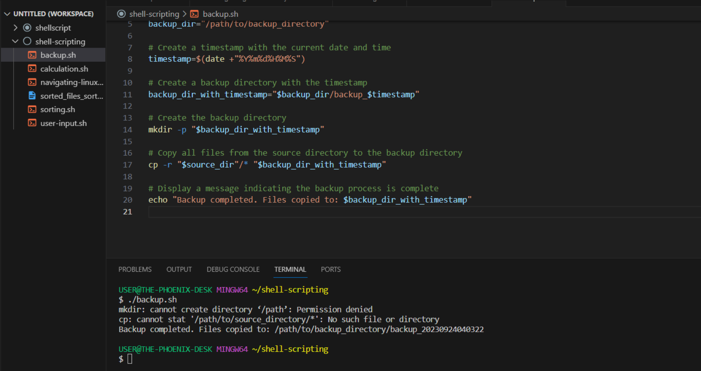


Project 3: **Shell Scripting Hands-on Project (Aux project on Darey.io)**, Completed! 

(c) Yemi Kareem