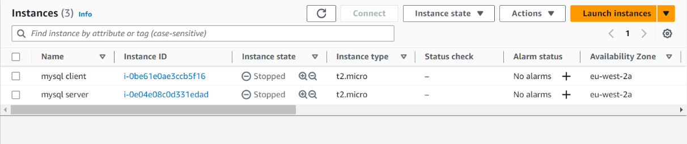

# IMPLEMENTING A CLIENT-SERVER ARCHITECTURE USING MYSQL RDBMS
### The objective is to implement a Client-Server Architecture using MySQL Database Management System

## 1. I [Created and configured](https://github.com/yemikareem/LampStackImplementation#step-0-the-prerequisites) two Linux-based virtual servers (EC2 instances in AWS)
Server A name - `mysql server`

Server B name - `mysql client`



## 2. On `mysql server` Linux server, I [installed MySQL](https://github.com/yemikareem/LampStackImplementation#step-2-installing-mysql) Server software 

```
sudo apt install mysql-server
```

## 3. On `mysql client` Linux server, install MySQL Server software (as above)

```
sudo apt install mysql-client
``` 

## 4. Used `mysql server`'s local IP Address to connect from `mysql client` 

MySQL server uses TCP port 3306 by default, so there was a need to create a new entry in *Inbound Rules* in *mysql server* Security Groups


## 5. Configured mySQL Server to allow connections from remote hosts

Run ```sudo vi /etc/mysql/mysql.conf.d/mysqld.cnf``` and edited the bind-address from *127.0.0.1* to *0.0.0.0.* 


## 6. From `mysql client` Linux Server, connected to `mysql server` Database Engine, without using SSH - using the [`MySQL` utility](https://github.com/yemikareem/LampStackImplementation#step-2-installing-mysql) to perform the action. 


### **EC2 Instance Connect Endpoint** was created 


### The **EC2 Instance Connect Endpoint** was used to launch the console and connect to the Ubuntu remote server


**Voila!**


Project 4: **Implementing a Client-Server Architecture using MySQL RDBMS**, Completed! 

(c) Yemi Kareem


