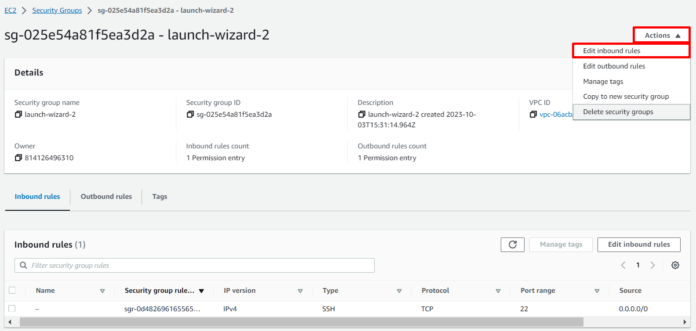

# IMPLEMENTING LOADBALANCERS WITH NGINX
### OBJECTIVE: To learn the art of loadbalancing in Nginx and how to distribute traffic efficiently across multiple servers, optimize performance and ensure high availability for web applications.  


## Introduction to Loadbalancing and Nginx

LOADBALANCING is the distribution of work or tasks among several computers or servers such that no one computer gets overloaded with too much work. This helps to keep everything running smoothly and ensures that websites and apps  work quickly and don't get too slow. It is like teamwork for computers! 

NGINX is a versatile software, as it can act like a webserver, a reverse proxy, and a load balancer, etc. One just have to configure it properly to serve the use case. 

### Setting Up a Basic Load Balancer 

TASKS:
1. I provisioned two EC2 instances running Ubuntu 22.04 and installed Apache webserver in them
2. Opened Port 8000 to allow traffic from anywhere
3. Updated the default page of the webservers to display their public IP address
4. Provisioned another EC2 instance running Ubuntu 22.04, this time, I installed Nginx and configured it to act as a load balancer distributing traffic across the webservers.

Step 1: Provisioning EC2 Instance

* Opened the AWS Management Console, clicked on EC2. Scrolled down the page to click on Launch instance: 


* Under Name, I provided a unique name for each of my webservers: 


* Under Applications and OS Images, I clicked on Quick Start and clicked on Ubuntu: 


* Under Key Pair, I clicked on Create new key pair. I usually use the same key pair for all the instances I provisioned for this project: 


* And finally, I clicked on Launch instance:


Step 2: Opened Port 8000. I ran my webservers on port 8000 while the load balancers ran on port 80. WSo, I opened port 8000 to allow traffic from anywhere. To do this, I needed to add rule to the security group of each of my webservers

* Clicked on the instance ID to get the details of my EC2 instance: 


* On that same page, I scrolled down and clicked on security: 


* Clicked on security group: 


* On the top of the page, clicked on **Action** and select **Edit Inbound Rules** : 


* Added my rules: 


* Clicked on save rules:


Step 3: Installed Apache Webserver

After provisioning both of my servers and have opened the necessary ports, it is time to install Apache software on both servers. To do so, I first connect to each of the webserver via ssh. Then I now run commands on the terminal of our webservers. 

* Connecting to the webserver: To connect to the webserver, I clicked on my instance id at the top of the page, then click on connect: 


* Next, copied the ssh command below: 


* Opened a terminal in my local machine, cd into the Downloads folder. Paste the ssh command copied in the previous step:


* Clicked on Enter, and typed yes when prompted. I was now connected to a terminal on my instance. 


* Next installed Apache with the command below: 

```
sudo apt update -y &&  sudo apt install apache2 -y
```


* Verify that Apache is running using the command below:
```
sudo systemctl status apache2
```


* Configure Apache to serve a page showing its public IP: 

I am to start by configuring Apache webserver to serve content on port 8000 instead of its default which is port 80. Then I created a new index.html file. The file contained code to display the public IP of the EC2 instance. I then overrode apache webserver's default html file with my new file. 

* Configuring Apache to serve content on port 8000: 

1. Using the text editor (e.g. vi, nano), I opened the file /etc/apache2/ports.conf
```
sudo vi /etc/apache2/ports.conf 
```

2. Added a new Listen directive for port 8000: First typed **i** to switch the editor to insert mode. Then add the Listen directive. Then I saved the file. 


3. Next I opened the file /etc/apache2/sites-available/000-default.conf and changed port 80 on the virtualhost to 8000 like the screenshot below: 

```
sudo vi /etc/apache2/sites-available/000-default.conf
```


 4. Close the file by first pressing the **esc** key on your keyboard then the command below:

```
:wqa!
```

5. Restarted Apache to load the new configuration using the command below:

```
sudo systemctl restart apache2
```

* Creating our new html file:

1. Open a new **index.html** file with the command below: 
```
sudo vi index.html
```
2. Switched vi editor to insert mode and pasted the html file below. 
Before pasting the html file, I got the public IP of my EC2 instance from AWS Management Console and replaced the placeholder text for IP address in the html file. 

```ruby
        <!DOCTYPE html>
        <html>
        <head>
            <title>My EC2 Instance</title>
        </head>
        <body>
            <h1>Welcome to my EC2 instance</h1>
            <p>Public IP: YOUR_PUBLIC_IP</p>
        </body>
        </html>

```
3. Changed file ownership of the index.html file with the command below: 

```
sudo chown www-data:www-data ./index.html
```

* Overrode the default html file of Apache webserver: 

1. Replace the default html file with our new html file using the command below: 

```
sudo cp -f ./index.html /var/www/html/index.html
```

2. Restarted the webserver to load the new configuration using the command below: 

```
sudo systemctl restart apache2
```

3. I found a page on the browser like this: 


Step 5: Configured Nginx as a Load Balancer

* I provisioned a new EC2 instance running Ubuntu 22.04. I made sure port 80 is opened to accept traffic from anywhere. One may refer to **Step 1** through **Step 2** to refresh your memory. 

* Next, SSH into the instance. Again, refer to **Step 3** for a refresher if needed.

* Installed Nginx into the instance using the command below: 
```
sudo apt update -y && sudo apt install nginx -y
```

* Verified that Nginx is installed with the command below: 
```
sudo systemctl status nginx
```


* Opened Nginx configuration file with the command below: 

```
sudo vi /etc/nginx/conf.d/loadbalancer.conf
```

* Paste the configuration file below to configure Nginx to act like a load balancer. See an example of config file in the screenshot shown below:
Make sure you edit the file and provide necessary information like your server IP address etc. 

```ruby
        
        upstream backend_servers {

            # you are to replace the public IP and Port to that of your webservers
            server 127.0.0.1:8000; # public IP and port for webserver 1
            server 127.0.0.1:8000; # public IP and port for webserver 2

        }

        server {
            listen 80;
            server_name <your load balancer's public IP address>; # provide your load balancers public IP address

            location / {
                proxy_pass http://backend_servers;
                proxy_set_header Host $host;
                proxy_set_header X-Real-IP $remote_addr;
                proxy_set_header X-Forwarded-For $proxy_add_x_forwarded_for;
            }
        }
    
```

**upstream backend_servers** defines a group of backend servers. The **server** lines inside the **upstream** block list the addresses and ports of your backend servers, passing the requests to the backend servers. the **proxy_set_header** lines pass necessary headers to the backend servers to correctly handle the requests. 

* Test your configuration with the command below: 

```
sudo nginx -t
```


* As there were no errors, I restarted Nginx to load the new configuration with the command below: 

```
sudo systemctl restart nginx
```

* Pasted the public IP address of nginx load balancer, I saw the same webpages served by the webservers. 


Project 5: **Implementing Loadblancers with Nginx**, Completed! 

(c) Yemi Kareem


# FURTHER NOTES
## Load Balancing Algorithms 

Load balancer algorithms are techniques used to distribute incoming network traffic or workload across multiple servers, ensuring efficient utilization of resources and improving overall system performance, reliability, and availability. Here are some common load balancer algorithms: 

1. **Round Robin:** This algorithm distributes requests sequentially to each server in the pool. It is simple to implement and ensures an even distribution of traffic. It works well when all servers have similar capabilities and resources. 

2. **Least Connections:** This algorithm routes new requests to the server with the least number of active connections. It is effective when servers have varying capacities or workloads, as it helps distribute traffic to the least busy server. 

3. **Weighted Round Robin:** Similar to the Round Robin algorithm, but servers are assigned different weights based on their capabilities. Servers with higher capacities receive more requests. This approach is useful when servers have varying capacities or performance levels. 

4. **Weighted Least Connections:** Similar to the Least Connections algorithm, but servers are assigned different weights based on their capabilities. Servers with higher capacities received more connections. This approach balances traffic based on server capacities. 

5. **IP Hash:** This algorithm uses a hash function based on the client's IP address to consistently map the client to a specific server. This ensures that the same client always reaches the same server, which can be helpful for maintaining session data or stateful connections. 

## SSL Termination and HTTPS Load Balancing
**Objective:** To understand the purpose of TLS certificate, how they work and the technology behind it.

### Encryption 
Encryption is at the core of TLS/SSL. It is the process of converting plain, readable data (referred to as plaintext) into an unreadable format called cyphertext. The purpose of encryption is to ensure data confidentiality and protect sensitive information from unauthorized access or interception. 

In encryption, an algorithm (known as a cryptographic algorithm) and a secret key are used to transform the plaintext into cyphertext. Only those who possess the correct key can decrypt the cyphertext and covert it back into it original plaintext form. 

### Types of Encryption
Encryption can be classified into several types based on various criteria, such as the encryption process, the key used, and the level of security provided. Below are some common types of encryption:

1. **Symmetric Encryption:** Here, the key is used for both encryption and decryption processes. Both the sender and the receiver must posses the shared secret key. While symmetric encryption is generally faster than other methods, distribution and managing the secret key securely among all parties can be challenging. 
Examples of symmetric encryption algorithms include Advanced Encryption Standard (AES) and Data Encryption Standard (DES) 

2. **Asymmetric Encryption:** Also know as Public-Key Encryption, uses two distinct keys, a public key and a private key. The public key is used for encryption, while the private key is used for decryption. Anyone can use the recipient's public key to encrypt data, but only the recipient with the matching private key can decrypt and read the data. This method eliminates the need for secure key distribution but is computationally more intensive than symmetric encryption. Popular asymmetric algorithms include Rivest-Shamir-Adleman (RSA) and Elliptic Curve Cryptography (ECC).

3. **Hybrid Encryption:** This combines both symmetric and asymmetric encryption. In this approach, the sender generates a random symmetric key for each message and encrypts the actual data using this symmetric key (which is efficient for large amounts of data). Then, the sender encrypts the symmetric key using the recipient's public key and sends both the encrypted data and the encrypted key to the recipient. The recipient can decrypt the symmetric key using their private key and use the symmetric key to decrypt the actual data. This method leverages the advantages of both symmetric and asymmetric encryption. 

### The Purpose of TLS/SSL Certificate
The main purpose of TSL/SSL certificates is to encrypt data transmitted between the web server and the client. This ensures that sensitive information such as login credentials, personal data, or credit card details, remains confidential and protected from eavesdropping. 

A secondary benefit is to establish trust between webservers and their client. Before data is transmitted between client and server, the server needs to go through the process of authentication (server proves that its identity is genuine) by presenting its certificate to the client which is validated by a trusted Certificate Authority (CA)

### How TSL/SSL Work

TSL/SSL works with hybrid encryption. This means that both symmetric and asymmetric encryption is used in TSL/SSL.

Before data is transmitted between client and server, the process of **TLS Handshake** is carried out. 

During TLS handshake, the server shares with the client its digital certificate. The digital certificate contains the public key of the server. 

The client(browser) verifies the validity of the server's public key using the public key of the **Certificate Authority** CA. If valid, the client encrypts its encryption key using the server's public key. This encrypted key is then sent to the server. 

The client generates its encryption key using symmetric encryption. The implication is that it uses the same key for both encryption and decryption hence the need to encrypt its key using the server public key. 

After the handshake process is completed, the client encrypts every data it sends to the server. the server is then able to decrypt the data with the client's encryption key. 

This ensures that only the server is able to make sense of the data shared by the client. 


## Advanced Load Balancing Features

This enhance the capabilities and efficiency of load balancers in handling complex scenarios and optimizing application performance. Here are some key advanced features: 

1. **SSL Offloading/Termination:** Load balancers can handle **Secure Socket Layer** (SSL) encryption and decryption on behalf of backend servers. This offloading reduces the computational burden on application servers, enabling them to focus on processing application logic instead of handling SSL/TLS encryption.

2. **Session Persistence/Sticky Sessions:** Some applications require that a client's request consistently go to the same backend server to maintain session state. Load balancers can use techniques like cookie-based or IP-based persistence to ensure requests from a specific client are directed to the same server throughout the session.

3. **Health Checks and Automatic Server Failover:** Load balancers can perform period health checks on backend servers to monitor their availability and performance. If a server becomes unresponsive or unhealthy, the load balancer can automatically remove if from the server pool, rerouting traffic to healthy servers, thus ensuring high availability. 

4. **Global Server Load balancing (GSLB):** GSLB enables load balancing across multiple data centres or geographically distributed server clusters. It helps direct traffic to the nearest or most available data centre, optimizing user experience and providing disaster recovery capabilities. 

5. **Application Layer Load Balancing:** Advanced load balancers can make routing decisions based on application-specific attributes beyond traditional IP and TCP/UDP information. For example, they can inspect HTTP headers or application-layer protocols to direct traffic based on content, URL, or user agent. 

6. **Dynamic Load Balancing:** Some load balancers use real-time analytics machine learning to dynamically adjust server weights or routing decisions based on current server performance, network conditions, and application demands. This adaptability ensures efficient resource utilization. 

7. **Anycast Load Balancing:** Anycast allows multiple load balancer instances to share the same IP address across different locations. When a client sends a request, it is automatically routed to the nearest load balancer instance, reducing latency and improving performance. 

8. **Rate Limiting and Traffic Shaping:** Load balancers can enforce rate limits on incoming requests from clients, preventing denial-of-service attacks and controlling resource utilization. they can also shape traffic, prioritizing certain types of requests over others based on defined policies. 

9. **Web Application Firewall (WAF) Integration:** Some load balancers offer integrated WAF functionality to protect web applications from common security threats like SQL injection, cross-site scripting (XSS), and other vulnerabilities. 

These advanced features make loadbalancers powerful tools for optimizing application performance, ensuring high availability, and protecting applications from various threats and failures. The are essential components in modern scalable, and robust IT infrastructures. 

