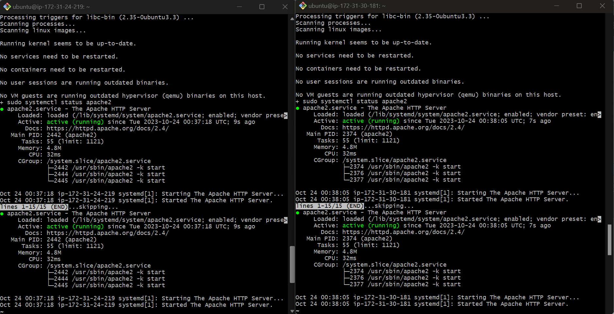

# AUTOMATING LOADBALANCER CONFIGURATION WITH SHELL SCRIPTING

### OBJECTIVE: To streamline loadbalancer configuration with ease using shell scripting and simple CI/CD on Jenkins; thereby enhancing efficiency and reducing manual effort. 

Unlike the steps taken in [**Implementing Loadbalancer with Nginx**](https://github.com/yemikareem/Devops_Projects/tree/main/Project-5_Loadbalancing-With-NGINX) course, where I deployed two backend servers with load balancer distributing traffic across the webservers by typing commands on my terminal; here, I automated the entire process. 

I did that by writing a shell script that when ran, all that I did manually will be done for me automatically. 

NB: **Automation is at the heart of DevOps Engineers work.** It helps speed the deployment of services and reduce the chance of making errors in day to day activity. 

## Implementation 
* Deployed two EC2 instances running Ubuntu 22.04.
* Automated the installation, deployment and configuration of Apache Webservers using shell script on the instances.
* Deployed a single EC2 instance running Ubuntu 22.04.
* Installed and configured Nginx as a Loadbalancer using shell script on the instance.

## DEPLOYING AND CONFIGURING WEBSERVERS

Every process I need to deploy my webservers has been codified in the shell script below: 

```ruby
#!/bin/bash

####################################################################################################################
##### This automates the installation and configuring of apache webserver to listen on port 8000
##### Usage: Call the script and pass in the Public_IP of your EC2 instance as the first argument as shown below:
######## ./install_configure_apache.sh 127.0.0.1
####################################################################################################################

set -x # debug mode
set -e # exit the script if there is an error
set -o pipefail # exit the script when there is a pipe failure

PUBLIC_IP=$1

[ -z "${PUBLIC_IP}" ] && echo "Please pass the public IP of your EC2 instance as an argument to the script" && exit 1

sudo apt update -y &&  sudo apt install apache2 -y

sudo systemctl status apache2

if [[ $? -eq 0 ]]; then
    sudo chmod 777 /etc/apache2/ports.conf
    echo "Listen 8000" >> /etc/apache2/ports.conf
    sudo chmod 777 -R /etc/apache2/

    sudo sed -i 's/<VirtualHost \*:80>/<VirtualHost *:8000>/' /etc/apache2/sites-available/000-default.conf

fi
sudo chmod 777 -R /var/www/
echo "<!DOCTYPE html>
        <html>
        <head>
            <title>My EC2 Instance</title>
        </head>
        <body>
            <h1>Welcome to my EC2 instance</h1>
            <p>Public IP: "${PUBLIC_IP}"</p>
        </body>
        </html>" > /var/www/html/index.html

sudo systemctl restart apache2

```

Using the steps below to run the script: 

**STEP 1:** I provisioned an EC2 instance running Ubuntu 20.04. Referencing **[Implementing Loadbalancer with Nginx](https://github.com/yemikareem/Devops_Projects/tree/main/Project-5_Loadbalancing-With-NGINX)** for a refresher. 

**STEP 2:** Opened port 8000 to allow traffic from ***Anywhere*** using the security group. Again, reference the project I mentioned above in Step 1 for a refresher. 

**STEP 3:** Connected to the 2 webservers separately via the terminal (VScode/GitBash) using *SSH client* 


**STEP 4:** Opened a file using the command ```sudo vi install.sh```, then pasted the script above and closed the file.


To close the file, typed the ```Esc``` key then ```Shift + :wqa!```

**STEP 5:** Changed the permission on the file to make an executable using the command below: 
```
sudo chmod +x install.sh
```

**STEP 6:** Ran the shell script using the command below. Make sure you read the instructions in the shell script to learn how to use it. 
```
./install.sh PUBLIC_IP
```


## AUTOMATING THE DEPLOYMENT OF NGINX AS A LOAD BALANCER USING SHELL SCRIPT
After a successful deployment and configuration of two webservers, I provisioned another EC2 instance running Ubuntu 22.04, opened port 80 to ***Anywhere*** using the security group and connected to the loadbalancer via the ***Terminal***.

### DEPLOYING AND CONFIGURING NGINX LOAD BALANCER 

All the steps followed in the **[Implementing Loadbalancer with Nginx](https://github.com/yemikareem/Devops_Projects/tree/main/Project-5_Loadbalancing-With-NGINX)** project has been codified below: 

```ruby

#!/bin/bash

######################################################################################################################
##### This automates the configuration of Nginx to act as a load balancer
##### Usage: The script is called with 3 command line arguments. The public IP of the EC2 instance where Nginx is installed
##### the webserver urls for which the load balancer distributes traffic. An example of how to call the script is shown below:
##### ./configure_nginx_loadbalancer.sh PUBLIC_IP Webserver-1 Webserver-2
#####  ./configure_nginx_loadbalancer.sh 127.0.0.1 192.2.4.6:8000  192.32.5.8:8000
############################################################################################################# 

PUBLIC_IP=$1
firstWebserver=$2
secondWebserver=$3

[ -z "${PUBLIC_IP}" ] && echo "Please pass the Public IP of your EC2 instance as the argument to the script" && exit 1

[ -z "${firstWebserver}" ] && echo "Please pass the Public IP together with its port number in this format: 127.0.0.1:8000 as the second argument to the script" && exit 1

[ -z "${secondWebserver}" ] && echo "Please pass the Public IP together with its port number in this format: 127.0.0.1:8000 as the third argument to the script" && exit 1

set -x # debug mode
set -e # exit the script if there is an error
set -o pipefail # exit the script when there is a pipe failure


sudo apt update -y && sudo apt install nginx -y
sudo systemctl status nginx

if [[ $? -eq 0 ]]; then
    sudo touch /etc/nginx/conf.d/loadbalancer.conf

    sudo chmod 777 /etc/nginx/conf.d/loadbalancer.conf
    sudo chmod 777 -R /etc/nginx/

    
    echo " upstream backend_servers {

            # your are to replace the public IP and Port to that of your webservers
            server  "${firstWebserver}"; # public IP and port for webserser 1
            server "${secondWebserver}"; # public IP and port for webserver 2

            }

           server {
            listen 80;
            server_name "${PUBLIC_IP}";

            location / {
                proxy_pass http://backend_servers;   
            }
    } " > /etc/nginx/conf.d/loadbalancer.conf
fi

sudo nginx -t

sudo systemctl restart nginx

```

## Steps to Run the Shell Script

**STEP 1:** On the terminal, I opened a file ***nginx.sh*** using the command below: 

```
sudo vi nginx.sh
```

**STEP 2:** Copied and pasted the script inside the file

**STEP 3:** Closed the file using the command below: 

```
press Esc, then Shift + :wqa!
```

**STEP 4:** Changed the file permission to make it an executable using the command below: 
```
sudo chmod +x nginx.sh
```

**STEP 5:** Ran the script with the command below: 
```
./nginx.sh PUBLIC_IP Webserver-1 Webserver-2
```


Confirm that Nginx is running 


## Verifying the Setup

### * Screenshot of Webserver One


### * Screenshot of Webserver Two


### * Screenshot of Loadbalancer


Project 6: **Automating Loadbalancer Configuration with Shell Scripting**, Completed! 

(c) Yemi Kareem