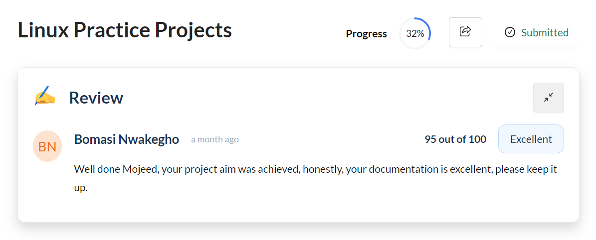
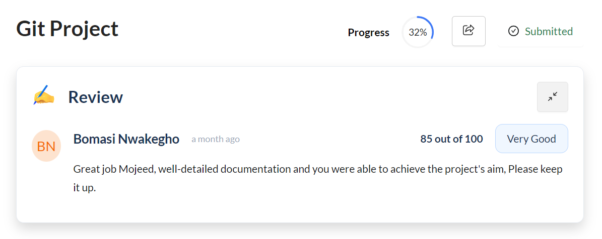
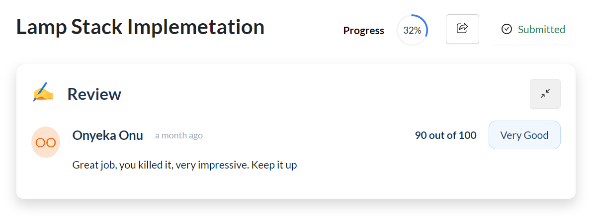
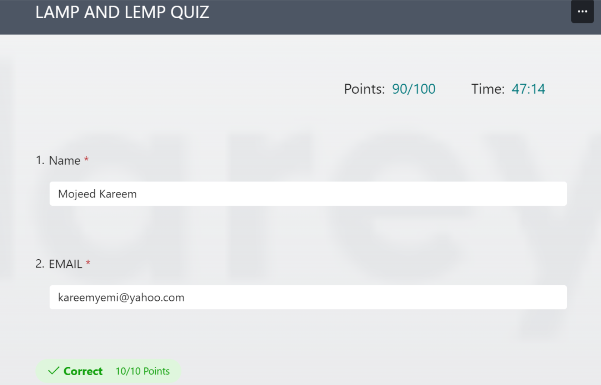
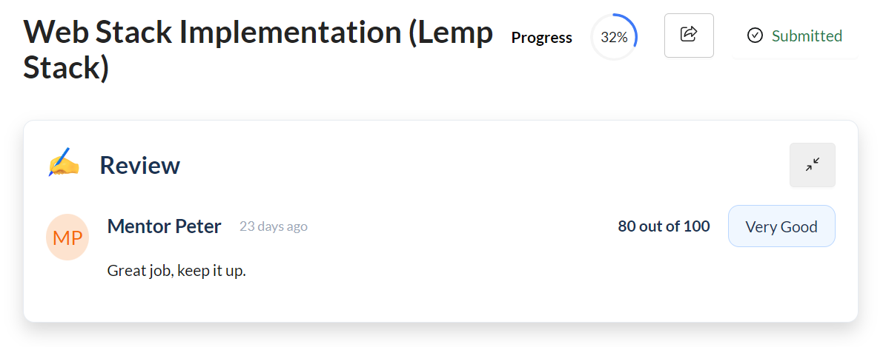
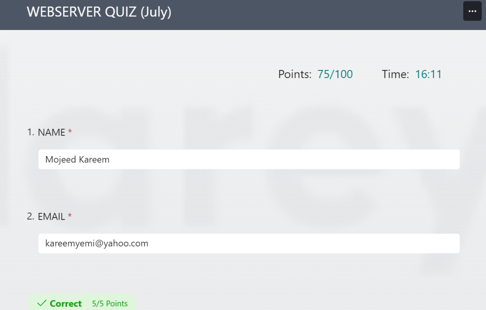
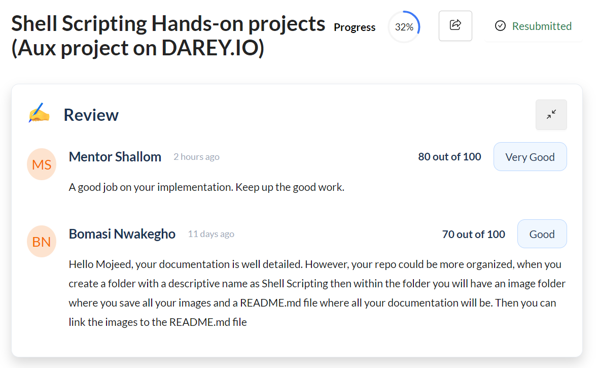
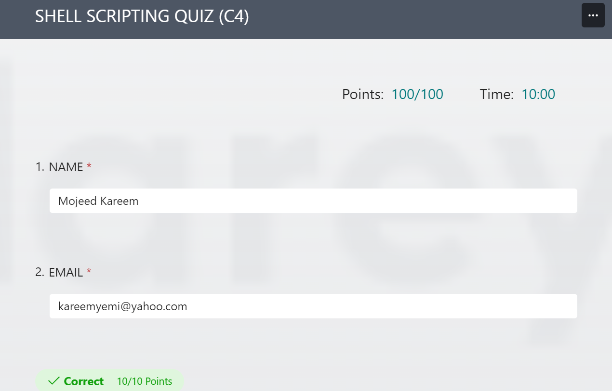
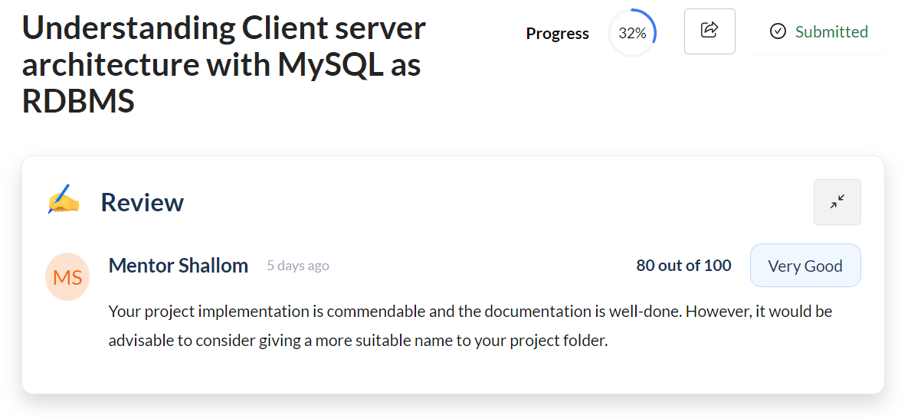
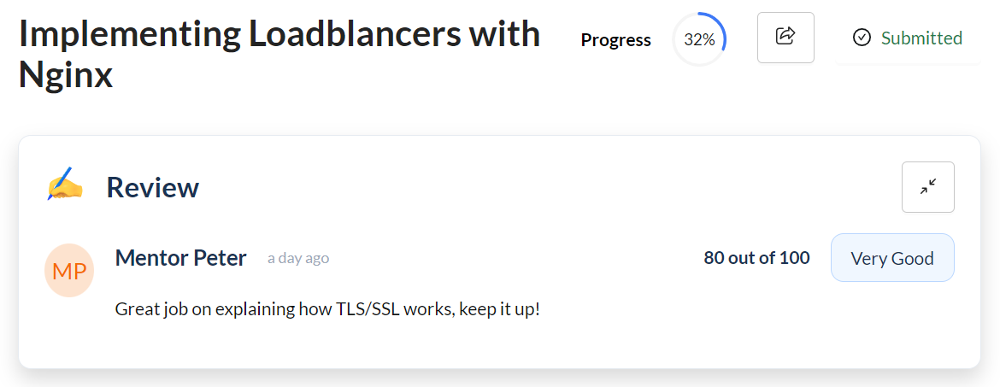

# MY DAREY.IO PROJECT REVIEWS AND SCORES

### Documenting my Darey.io Project Reviews and Scores by the Community Tutors and Mentors

## 1. LINUX PRACTICE PROJECTS

## 2. GIT PROJECT

.png>)

## 3. LAMP STACK IMPLEMENTATION

## 4. WEB STACK IMPLEMENTATION - LEMP STACK

.png)

## 5. SHELL SCRIPTING

## 6. UNDERSTANDING CLIENT-SERVER ARCHITECTURE WITH MYSQL AS RDBMS

## 7. IMPLEMENTING LOADBALANCERS WITH NGINX

